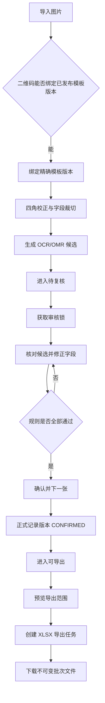
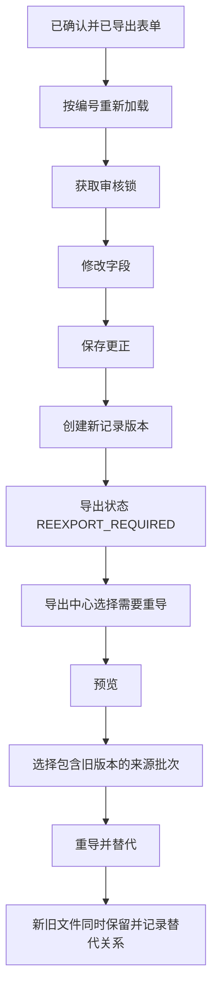

# 当前网页界面与交互闭环说明

最后核对：2026-07-17

代码基线：`35c1243 fix(frontend): support exported form corrections`

网页入口：`http://127.0.0.1:5173/`
用途：为后续网页端样式重建提供现状说明。本文描述的是**当前真实行为**，不是最终视觉方案。

> 后续开发不应只凭本文直接改代码。批准后的目标结构、逐任务文件清单、测试命令和验收标准统一见 [工业表单前端重建实施计划](superpowers/plans/2026-07-17-frontend-rebuild-implementation.md)。本文只负责说明改造前的真实行为和必须保留的业务闭环。

## 1. 前端现有信息架构

当前前端不是多 URL 路由，而是在一个 React 应用内切换四个功能区：

```text
审核工作台
├─ 待分类
├─ 待复核
├─ 规则异常
├─ 可导出 → 导出中心
├─ 数据管理 → 直接打开图片选择器
├─ 模板与字段 → 模板中心
├─ 员工 / 工单 → 主数据中心
└─ 产品 / 工序 → 主数据中心

模板中心
├─ 模板库
├─ 已发布版本只读预览
└─ 草稿设计器

主数据中心
├─ 员工
├─ 工单
├─ 产品
└─ 工序

导出中心
├─ 筛选与预览
├─ 创建导出任务
├─ 任务进度
└─ 历史批次、下载与重导
```

页面切换前如果存在未保存的审核修改，系统弹窗询问是否离开。刷新浏览器会回到应用初始状态，不保留当前功能区 URL。

## 2. 全局外壳与左侧导航

### 顶栏

| 元素 | 当前作用 |
|---|---|
| `产量采集工作台` | 产品名称，仅作展示。 |
| `人工审核 · 本地服务` | 当前运行环境提示；目前不是实时健康检查控件。 |

### 审核队列

| 按钮 | 实际筛选或跳转 |
|---|---|
| `待分类` | 显示 `NEEDS_CLASSIFICATION` 表单，即二维码没有成功确定模板版本的表单。 |
| `待复核` | 显示已导入、已分类、已识别或需要人工审核的表单。 |
| `规则异常` | 显示已经退回、需要重新采集的 `RECAPTURE_REQUIRED` 表单。 |
| `可导出` | 不显示普通队列列表，直接切换到导出中心。 |

每个队列按钮右侧显示当前数量。选择队列中的表单后加载其详情。

### 次级导航

| 按钮 | 当前真实行为 | 重建时注意 |
|---|---|---|
| `数据管理` | 返回审核页后立即打开图片文件选择器。 | 名称容易被理解为数据库或主数据管理，建议重命名为“导入图片”。 |
| `模板与字段` | 进入模板库。 | 是独立全屏功能区，通过“返回审核工作台”返回。 |
| `员工 / 工单` | 进入主数据中心。 | 默认打开员工页。 |
| `产品 / 工序` | 也进入同一个主数据中心。 | 当前仍默认打开员工页，没有自动定位到产品或工序，属于待改善交互。 |

## 3. 审核工作台

### 3.1 表单加载与图片导入

| 控件 | 作用 | 条件或结果 |
|---|---|---|
| `表单编号`输入框 | 输入已存在的表单编号。 | 空值提交时提示先输入编号。 |
| `加载表单` | 按编号加载表单详情、历史、字段、证据和草稿。 | 切换前会检查未保存修改。 |
| `导入图片` | 上传 PNG、JPEG 或 TIFF。 | 成功后自动打开新表单；其他文件类型被拒绝。 |
| `获取审核锁` | 为当前表单获取编辑租约。 | 没有锁时不能保存草稿、确认、退回或作废。 |
| `释放` | 主动释放当前审核锁。 | 有未保存修改时再次确认；锁存续期间每两分钟续期。 |

加载后顶部显示：表单编号、模板编号与版本、记录版本、导出状态和审核锁有效期。

### 3.2 重复图片分支

上传内容与已有原图完全相同时显示“图片已经导入”，并根据当前环境提供以下按钮：

| 按钮 | 作用 |
|---|---|
| `打开已有表单` | 打开该图片已经关联的表单。 |
| `重新用于本地测试` | 仅本地开发管理员可用；将已作废测试表单重新放回可测试状态。 |
| `彻底清除测试数据` | 仅本地开发管理员可用；二次确认后删除该测试表单及证据，不是生产操作。 |

如果表单已经退回，界面提示必须上传内容不同的新照片，不能重复使用原图。

### 3.3 人工模板分类

当二维码无法识别或无法绑定有效已发布版本时，主区域替换为人工分类卡片：

| 控件 | 作用 |
|---|---|
| `已发布模板` | 选择明确的模板键和版本；选项同时显示字段数。 |
| `分类原因` | 必填，最多 500 字，用于审计。 |
| `确认分类并创建识别任务` | 保存人工选择并创建后续识别任务。 |

系统不会根据相似度自动猜模板。人工必须选择**具体模板版本**并说明原因。

### 3.4 图片证据与字段表格

桌面宽屏采用左图右表，窄屏提供 `图片` / `电子表格` 两个切换按钮。

#### 图片区域

- 优先显示经过四角标记校正的标准画布。
- 校正成功时叠加字段框；点击字段框会同步选中右侧字段。
- 没有完成四角校正时显示原始证据，并隐藏标准字段框，防止坐标错误覆盖。
- 当前没有图片缩放、旋转、复位和字段裁片详情按钮。

#### 电子表格区域

每行显示：字段名称、识别结果、置信度、确认值和状态。

- 有主数据选项或允许值时，确认值使用下拉框。
- 其他字段使用输入框。
- 低置信度、必填缺失、类型错误、数值范围或允许值不合规时显示“待确认”及原因。
- 点击字段行会同步定位左侧字段框，并更新下方候选详情。

#### 规则与建议抽屉

| 内容或按钮 | 作用 |
|---|---|
| `识别候选`按钮 | 显示候选值和置信度；点击后把候选写入确认值。 |
| `历史版本` | 只显示版本数和审计事件数。 |
| `证据` | 只显示受控文件数量。 |
| `待确认数量` | 汇总当前仍会阻止正式确认的字段数量。 |

人工字段不会生成 OCR 候选；没有候选时明确显示原因。

### 3.5 底部审核动作

| 按钮 | 作用 | 关键约束 |
|---|---|---|
| `退回` | 弹窗要求填写原因，随后清除草稿和租约，将表单送入重新采集状态。 | 必须已获取审核锁；原因必填。 |
| `作废` | 弹窗要求填写原因，创建不可变作废版本并移出审核队列。 | 必须已获取审核锁；原因必填。 |
| `保存草稿` | 保存人工修改，但不改变正式记录。 | 必须有锁且确实存在未保存修改。 |
| `确认并下一张` | 写入正式版本，同时释放当前锁并原子领取待复核队列的下一张。 | 所有字段就绪、当前位于待复核队列、已获取锁。 |
| `保存更正` | 对已有正式记录创建新版本；保留当前表单以核对导出状态。 | 加载的表单已有记录版本时替代“确认并下一张”。 |

如果后端最终规则拒绝确认，相关字段会标红，顶部显示“审核规则拦截”。

## 4. 模板中心

### 4.1 模板库

| 控件或按钮 | 作用 |
|---|---|
| `返回审核工作台` | 返回主工作台。 |
| `搜索模板` | 按模板名称或模板键过滤。 |
| `全部` | 显示全部模板。 |
| `已发布` | 只显示发布版本。 |
| `可编辑草稿` | 显示草稿或存在活动草稿的模板。 |
| `创建空白模板` | 根据名称、模板键、用途说明和 A4/A5 页面创建草稿，并进入设计器。 |
| `模板包导入…` | 当前禁用，安全 ZIP 导入尚未实现。 |
| `查看只读预览` | 打开已发布、已停用或已退役版本的预览。 |
| `继续编辑草稿` | 打开可编辑草稿。 |
| `编辑名称与说明` | 就地编辑模板公共名称和用途。 |
| `保存信息` / `取消` | 保存或取消名称与用途编辑。 |
| `放弃草稿` | 二次确认后永久删除未发布草稿及其字段。 |
| `退役模板` | 二次确认后停止该模板用于新分类和打印；历史记录保留。存在活动草稿时禁用。 |

当前创建页只支持 A4/A5，不支持自定义毫米尺寸。

### 4.2 已发布模板预览

| 按钮或链接 | 作用 |
|---|---|
| `返回模板库` | 返回模板列表。 |
| `重试` | 预览加载失败时重新请求。 |
| `打开 <文件名>` | 在新标签打开 PNG/PDF 打印产物。 |
| `基于此模板调优` | 克隆已发布版本为新的可编辑草稿。 |

已退役模板只能历史查看，不能继续调优。

### 4.3 草稿设计器

设计器由左侧图层、中间画布、右侧字段属性和底部预检区组成。

#### 左侧

| 按钮 | 作用 |
|---|---|
| `保存模板信息` | 保存模板名称和用途说明。 |
| 字段图层按钮 | 选择字段，并同步选中画布与右侧属性。 |
| `加入字段` | 根据字段键、显示名和识别引擎添加一个新字段。 |
| `运行发布预检` | 检查字段、坐标、保护区、规则和导出映射；字段变化后需要重跑。 |
| `发布模板` | 仅预检通过、状态为 `READY_TO_PUBLISH` 时可用；发布后只读并生成打印产物。 |
| `放弃草稿` | 二次确认后删除整个草稿。 |

#### 中间画布

- 显示打印边界、模板二维码区、纸张实例码区和 ArUco 10/11/12/13 四角标记。
- 点击字段选中；拖动字段改变位置；拖动右下角改变大小。
- 方向键移动字段；`Shift + 方向键`使用更大步长；`Alt + 方向键`调整大小。
- 字段不能越界或覆盖保护区；失败时恢复原位置并显示错误。
- 当前是比例坐标自由移动，不是已经讨论的毫米网格吸附小模块系统。

#### 右侧字段属性

可以修改显示名、数据类型、输入类型、识别引擎、自动预填阈值、必填、数值范围、允许值、主数据源、异常说明、导出工作簿/工作表/业务列和坐标。

| 按钮 | 作用 |
|---|---|
| `保存字段` | 保存右侧全部字段配置。 |
| `删除字段` | 二次确认后删除字段。 |

发布版本全部只读；任何调优必须创建新草稿版本。

## 5. 主数据中心

主数据用于审核下拉项和稳定业务编码。当前包含员工、工单、产品、工序四个目录。

| 控件或按钮 | 作用 |
|---|---|
| `返回审核工作台` | 返回主工作台。 |
| `员工` / `工单` / `产品` / `工序` | 切换目录。 |
| `新增…` | 清空编辑区，进入新建模式。 |
| 搜索框 + `搜索` | 按编码或名称过滤当前目录。 |
| `显示已停用记录` | 在列表中包含逻辑停用的数据。 |
| 左侧记录按钮 | 选择记录，加载当前版本和审计轨迹。 |
| `创建记录` | 新建稳定编码记录。编码、名称、属性 JSON 和变更原因均必填或必须有效。 |
| `保存新版本` | 以乐观版本方式更新名称和扩展属性；编码不可修改。 |
| `停用记录` | 原因必填；从默认列表和审核选项中移除，但不删除历史。 |
| `恢复使用` | 原因必填；重新启用记录。 |

当前“扩展属性”直接要求用户编辑 JSON 对象，适合技术演示，不适合最终非技术用户界面。

## 6. 导出中心

### 6.1 筛选与预览

可按表单编号、员工编号、工单编号、审核状态、导出状态和导出类型筛选。

| 控件或按钮 | 作用 |
|---|---|
| `预览导出范围` | 执行只读最终校验，不生成文件。修改任何筛选条件都会使旧预览失效。 |
| `创建导出任务` | 对“拟包含记录”创建异步 XLSX 任务。没有可包含记录时禁用。 |

预览分成三部分：

1. **拟包含记录**：通过最终校验的表单和记录版本。
2. **排除记录与规则**：显示表单级或字段级排除原因。
3. **字段映射**：显示模板字段到工作簿、工作表和业务列的不可变映射快照。

创建任务后显示任务编号、状态、进度百分比和当前步骤。成功后刷新历史批次。

### 6.2 历史、下载和重导

| 按钮 | 作用 |
|---|---|
| `刷新历史` | 重新加载成功导出批次。 |
| `查看详情` | 展开操作者、映射哈希、文件哈希和被替代批次。 |
| `关闭` | 关闭批次详情。 |
| `下载 <文件名>` | 通过授权接口下载对应 XLSX。 |
| `重导并替代 <批次>` | 在“需要重导”模式下，用新文件显式替代符合条件的旧批次。 |
| `不可作为来源…` | 禁用状态；说明该批次没有覆盖当前所有拟重导表单的旧版本。 |

重导不会覆盖旧文件。必须先选择导出状态“需要重导”，重新预览，再从历史中选择包含这些表单旧版本的真实来源批次。

## 7. 完整业务闭环

### 7.1 正常二维码路径



### 7.2 二维码失败路径

```text
导入图片
→ 状态 NEEDS_CLASSIFICATION
→ 人工选择精确已发布模板版本
→ 填写分类原因
→ 确认分类并创建识别任务
→ 进入待复核
→ 按正常审核和导出路径继续
```

### 7.3 退回与重新采集

```text
审核发现图片或内容无法继续
→ 获取审核锁
→ 点击退回
→ 填写原因
→ 状态 RECAPTURE_REQUIRED
→ 进入“规则异常”队列
→ 必须上传内容不同的新照片
```

### 7.4 导出后更正与重导



## 8. 状态词典

### 审核状态

| 状态 | 用户含义 |
|---|---|
| `IMPORTED` | 已导入，等待后续处理。 |
| `NEEDS_CLASSIFICATION` | 二维码未能确定模板，等待人工分类。 |
| `CLASSIFIED` | 已确定模板，等待识别或复核。 |
| `RECOGNIZED` / `NEEDS_REVIEW` | 已生成候选，需要人工复核。 |
| `RECAPTURE_REQUIRED` | 已退回，需重新采集图片。 |
| `CONFIRMED` / `CORRECTED` | 已确认或已更正，可进入导出判断。 |
| `VOIDED` | 已作废，保留审计但退出正常流程。 |

### 导出状态

| 状态 | 用户含义 |
|---|---|
| `NOT_EXPORTED` | 尚未导出。 |
| `EXPORTED` | 已包含在成功导出批次中。 |
| `REEXPORT_REQUIRED` | 导出后发生更正或作废，需要生成替代批次。 |

### 模板状态

| 状态 | 用户含义 |
|---|---|
| `DRAFT` | 可编辑草稿。 |
| `PREFLIGHT_FAILED` | 发布预检失败，需要修改后重跑。 |
| `READY_TO_PUBLISH` | 预检通过，可以发布。 |
| `PUBLISHED` | 已发布，只读，可用于分类和打印。 |
| `DEPRECATED` / `RETIRED` | 已停用或退役，仅保留历史追溯。 |

## 9. 样式重建时必须保留的业务语义

视觉和布局可以重做，但以下行为不能被样式重建破坏：

1. 二维码失败时不能自动猜模板，必须人工选择精确发布版本并填写原因。
2. 审核写操作必须有有效审核锁，并处理锁过期和并发版本冲突。
3. 未保存修改离开页面前必须提醒。
4. 候选值不能自动覆盖正式值；正式值必须经过规则校验和人工确认。
5. 退回、作废、人工分类、主数据变更和模板退役必须保留原因或确认步骤。
6. 已发布模板不可原地编辑，只能克隆新草稿。
7. 导出前必须先预览并显示排除原因；筛选变化后旧预览必须失效。
8. 导出后更正必须进入重导状态；重导创建新批次并保留旧文件。
9. 原图、校正图、字段裁片、记录版本和导出批次必须保持可追溯。
10. 权限不足时要给出用户可理解的提示，不能只显示技术错误码。

## 10. 当前前端值得在重建中解决的问题

1. 没有登录页或身份切换入口，但权限会直接阻止导入、模板和主数据操作。
2. `数据管理`按钮实际执行“导入图片”，名称与动作不一致。
3. `员工 / 工单`与`产品 / 工序`两个入口进入同一页面，后者没有定位到对应标签。
4. `可导出`外观像队列，行为却是进入独立导出中心。
5. 没有浏览器路由，刷新后丢失当前位置，也不能复制页面链接。
6. 审核历史和证据目前只显示数量，无法直接展开查看。
7. 图片区缺少缩放、旋转、复位和字段裁片详情。
8. 没有显式“上一张/下一张”，只有确认成功后自动领取下一张。
9. 主数据扩展属性使用原始 JSON 文本，不适合非技术用户。
10. 部分界面直接显示 `CONFIRMED`、`REEXPORT_REQUIRED` 等英文状态码。
11. 模板创建只支持 A4/A5，当前字段编辑是比例坐标自由拖动，尚未支持任意毫米横条、小模块和网格吸附。
12. 模板、主数据和导出中心采用全屏替换，导航层级、返回位置和跨模块上下文不够清晰。
13. 顶栏“本地服务”目前主要是视觉提示，没有把连接状态、当前身份和权限能力解释给用户。

## 11. 给下一次网页端对话的重建边界

下一次讨论可以自由调整：导航结构、页面布局、视觉层级、按钮文案、颜色、密度、响应式方式、空状态和错误提示。

暂时不要在纯样式重建中修改：后端 API、状态机、权限矩阵、模板版本规则、审核事务、导出批次规则、数据库和识别算法。若新设计需要改变这些语义，应单独列为产品或后端任务，不要混入 CSS/组件重排。

建议网页端重建首先输出：

1. 新的信息架构与路由图。
2. 审核工作台桌面与窄屏线框图。
3. 每个按钮的新名称、位置、可用条件和结果。
4. 正常、二维码失败、退回、作废、更正、重导六条交互原型。
5. 权限不足、锁失效、重复图片、规则拦截、空队列和任务失败的错误状态。
6. 与本文“必须保留的业务语义”逐项对照表。

## 12. 当前实现依据

- 审核工作台与导航：`frontend/apps/web/src/App.tsx`
- 模板库：`frontend/apps/web/src/TemplateLibrary_ds.tsx`
- 模板设计器：`frontend/apps/web/src/TemplateStudio_ds.tsx`
- 模板画布：`frontend/apps/web/src/TemplateCanvasEditor_ds.tsx`
- 字段属性：`frontend/apps/web/src/FieldInspector_ds.tsx`
- 模板预览：`frontend/apps/web/src/TemplatePreview_ds.tsx`
- 主数据中心：`frontend/apps/web/src/MasterDataCenter_ds.tsx`
- 导出中心：`frontend/apps/web/src/ExportCenter_ds.tsx`
- 队列状态映射：`app/api/routers/workbench_ds.py`
- 审核与导出状态：`app/domain/models.py`
