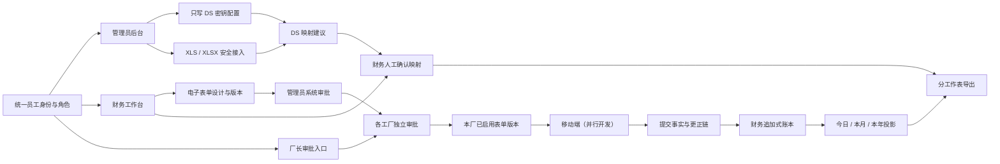

# 管理员端、财务端与后台服务重构开发设计

日期：2026-07-22

状态：设计已确认，待项目负责人审阅

实施路线：模块化替换（方案 B）

实施说明：本文只定义开发方案，不在本轮实施代码

## 1. 文档目的

本设计把当前以“纸质表单照片识别”为中心的网页端和后端，重构为以“电子表单配置、移动端提交、财务实时账表和受控导出”为中心的系统。

本轮只设计以下范围：

- 网页管理员端；
- 网页财务端；
- 厂长表单审批所需的后端契约；
- 管理员、财务和移动端共用的后台服务；
- 旧照片识别链路的完整退役方案。

移动端正在另一条开发会话中修改。实施本文时不得直接修改 `frontend/apps/web/src/mobile/**`；需要新增能力时，必须通过向后兼容的 API 和版本化数据契约衔接。

## 2. 已确认的产品决策

1. 旧照片导入、OCR、OMR、自动填写、图片复核和重拍逻辑没有历史业务数据，可以完整删除。
2. 网页管理员端和财务端复用现有员工账号、工厂和角色体系，不建立第二套后台账号。
3. 管理员负责人员、工厂、角色、DS 接入、外部报表模板文件接入、系统级表单审批和审计。
4. 财务负责电子表单设计、计算规则、外部报表模板的业务映射、DS 字段映射确认、财务账表和导出。
5. 财务设计的表单必须经过管理员审批和厂长同意。
6. 多工厂表单按工厂独立启用：哪个工厂的厂长同意，哪个工厂可以使用，不等待其他工厂。
7. 财务账表按服务端成功接收提交的时间 `submitted_at` 归属日期，不使用表单内手填日期，也不使用审核时间。
8. 系统维护今日、本月、本年三个实时财务视图。
9. 不同表单类型在导出工作簿中使用不同工作表。
10. 外部模板首期必须支持 `.xls` 和 `.xlsx`。
11. DS 分析外部模板并提出字段映射建议，但只有财务确认后才能发布和用于正式导出。
12. 不支持的文件格式只能进入受控适配流程；DS 不能绕过文件解析器直接处理未知二进制文件。
13. 原始提交和更正记录都必须保留。更正采用追加记录，不覆盖旧行。
14. 管理员可以新增、替换和删除 DS API Key，但任何人都不能查看已保存的密钥明文。

## 3. 目标与非目标

### 3.1 目标

- 让管理员和财务登录后只看到与自身角色相关的网页工作区。
- 用电子表单设计器替代纸张模板和识别区域设计器。
- 建立可审计、不可变、可按工厂独立启用的表单版本体系。
- 让移动端成功提交的数据实时进入财务今日、本月和本年账表。
- 支持原始记录、更正记录和历史导出批次的完整追溯。
- 支持财务部已有 `.xls/.xlsx` 模板的导入、解析、DS 映射建议、人工确认和版本化发布。
- 将 DeepSeek 配置入口从环境变量专用模式升级为管理员可操作的安全配置入口。
- 完整移除无业务价值的识别链路，降低前后端复杂度。

### 3.2 非目标

- 不重写移动端页面。
- 不让 DS 自动批准字段映射、自动发布表单或绕过财务确认。
- 不把 Excel/WPS 文件作为系统事实来源。
- 不允许原地覆盖已提交记录、已发布表单版本或已发布导出模板版本。
- 不修改、压缩或删除既有 Alembic 历史迁移文件。
- 首期不承诺直接支持 `.et`、`.csv`、PDF 或任意未知格式。
- 不在浏览器、日志、审计事件或普通数据库字段中返回 DS API Key 明文。

## 4. 总体架构

### 4.1 架构原则

1. 数据库账本是唯一事实来源，XLS/XLSX 是可重新生成的派生产物。
2. 权限由服务端判断，前端隐藏菜单不能代替后端鉴权。
3. 已发布内容不可原地修改；变更通过新版本或更正事件表达。
4. 表单定义、工厂启用、提交事实、财务账本和导出模板是独立边界。
5. DS 只负责生成建议，不拥有审批权、发布权和导出执行权。
6. 秘密配置与普通业务配置隔离。
7. 移动端只依赖稳定的已发布表单读取接口和提交接口。

### 4.2 目标模块

| 模块 | 责任 | 主要依赖 |
|---|---|---|
| `identity_access` | 登录会话、员工、工厂、角色和服务端鉴权 | 现有身份数据 |
| `admin_console` | 管理概览、人员与工厂、角色授权、系统审批、审计查询 | `identity_access`、`audit` |
| `secret_config` | DS 密钥写入、替换、删除、状态和连接测试 | 操作系统安全存储 |
| `electronic_form_studio` | 表单草稿、字段、计算规则、版本、审批和按厂启用 | `identity_access` |
| `submission_ledger` | 接收移动提交、更正链、幂等和提交时间 | 现有电子提交事务能力 |
| `finance_ledger` | 今日/月度/年度投影、审核状态和更正展示 | `submission_ledger` |
| `report_templates` | XLS/XLSX 解析、结构模型、字段映射和模板版本 | 安全文件存储、DS 适配器 |
| `reporting` | 分工作表生成、产物缓存、导出批次和下载 | `finance_ledger`、`report_templates` |
| `audit` | 记录高风险操作与业务状态变化 | 所有写入模块 |

### 4.3 目标数据流



### 4.4 保留并重用

- 现有员工身份、工厂隔离和角色目录；
- 现有 HttpOnly 会话、CSRF 和服务端身份解析能力；
- 不可变版本、审计事件和更正链思想；
- 现有电子提交的事务、幂等和回执基础设施；
- 现有竹丝生产与工资事实；
- 现有 XLSX 写出、下载和导出批次中仍然通用的部分；
- SQLite、SQLAlchemy、Alembic、FastAPI 和 React/PWA 技术栈。

### 4.5 完整退役

- 照片单张和批量导入；
- 图片总览、缩略图墙和导入批次页面；
- OCR、数字识别、OMR、透视校正和识别候选；
- 自动填写和识别置信度排序；
- 图片证据审核工作台、图片字段框联动和重拍；
- 纸张尺寸、打印定位标记、识别区域和纸张识别调试；
- 只为以上功能存在的后台任务、API、服务装配和测试。

删除前必须做依赖审计。若某个“旧模块”同时承载仍在使用的通用版本、审计或 Excel 能力，应先把通用能力迁移到新边界，再删除旧壳。

## 5. 角色与权限

### 5.1 角色来源

网页端复用现有员工账号和角色。至少识别以下角色：

- `SYSTEM_ADMIN`：系统管理员；
- `FINANCE_APPROVER`：财务人员；
- `PLANT_MANAGER`：厂长。

同一账号拥有多个角色时，登录后可在已授权工作区之间切换。所有数据查询继续受工厂范围限制。

### 5.2 权限矩阵

| 操作 | 管理员 | 财务 | 厂长 |
|---|---:|---:|---:|
| 管理员工、工厂和角色 | 是 | 否 | 仅查看本厂必要信息 |
| 新增、替换、删除 DS Key | 是 | 否 | 否 |
| 查看 DS Key 明文 | 否 | 否 | 否 |
| 创建和编辑表单草稿 | 否 | 是 | 否 |
| 提交表单系统审批 | 否 | 是 | 否 |
| 管理员审批表单 | 是 | 否 | 否 |
| 同意本厂使用表单 | 否 | 否 | 是 |
| 上传外部 XLS/XLSX 模板 | 是 | 否 | 否 |
| 确认 DS 字段映射 | 否 | 是 | 否 |
| 查看财务今日/月度/年度账表 | 审计只读 | 是 | 本厂受限只读（如授权） |
| 审核、更正和正式导出 | 否 | 是 | 否 |
| 查看全局审计 | 是 | 仅财务相关 | 仅本厂相关 |

## 6. 网页信息架构

### 6.1 登录与路由

网页端不再默认进入图片审核工作台。登录成功后按角色进入：

- 管理员默认路由：`/admin/overview`；
- 财务默认路由：`/finance/today`；
- 同时具有两种角色：先进入最近一次工作区，并提供工作区切换器；
- 未授权访问返回 `403`，不使用静默重定向掩盖权限错误。

移动端 `/mobile/**` 路由保持独立，不纳入本轮网页导航重构。

### 6.2 管理员后台

#### 系统概览

- 待管理员审批表单数；
- 待处理角色或工厂事项；
- DS 接入状态；
- 最近失败的模板解析或导出任务；
- 最近高风险操作。

#### 组织与人员

- 工厂列表和状态；
- 员工搜索、所属工厂、当前角色和状态；
- 角色授予、撤销和跨厂调动；
- 所有变更要求原因并写审计。

#### DS 接入设置

- 显示“未配置/已配置/连接异常/已停用”；
- 显示密钥更新时间和最后操作人；
- 允许新增、替换、删除、启用、停用和连接测试；
- 不显示密钥尾号，不提供复制、查看或下载；
- 替换密钥时必须输入完整新密钥；
- 删除和替换属于高风险操作，需要二次确认。

#### 外部报表模板接入

- 上传财务部提供的 `.xls` 或 `.xlsx` 原始模板；
- 执行文件类型、大小、哈希和安全检查；
- 查看解析成功或失败状态，但不决定业务字段映射；
- 解析成功后把模板交付到财务工作台；
- 替换原始模板必须创建新版本，不能覆盖已经发布或导出使用过的版本。

#### 表单系统审批

- 展示财务提交的表单版本；
- 显示字段、计算规则和适用工厂的结构化差异；
- 管理员只审核系统合法性、权限和数据规则，不替代财务业务判断；
- 同意后进入各适用工厂的厂长审批队列；
- 驳回必须填写原因，草稿返回财务修改。

#### 审计中心

- 支持按时间、操作人、工厂、资源类型和动作筛选；
- 可查看表单审批、厂长启用、DS 配置、模板发布、账表更正和导出批次；
- 审计只显示 DS 密钥动作，不显示密钥内容。

### 6.3 财务工作台

#### 今日账表

- 默认时间范围为服务器本地时区当天 `00:00:00` 至当前时刻；
- 数据按 `submitted_at` 实时追加；
- 提供新数据提示、手动刷新和自动刷新；
- 按表单类型分组，可切换不同工作表视图；
- 显示原始记录、更正记录、财务状态和来源版本；
- 可查看提交明细和完整审计链，但不能修改原始提交。

#### 本月与本年

- 使用与今日相同的数据口径；
- 月度范围为当前自然月，年度范围为当前自然年；
- 支持选择历史月份或年份；
- 大数据量使用服务端分页、汇总和异步导出，不把全量数据一次加载到浏览器。

#### 电子表单设计器

- 管理表单名称、用途、适用工厂和状态；
- 支持字段分组、字段顺序、显示名称、数据类型、必填、默认值、选项和说明；
- 支持受控计算字段和工资规则引用；
- 支持移动端友好的分段和卡片元数据，但不在本轮实现移动端渲染；
- 提供手机宽度预览，预览只验证定义结构，不复制移动端业务代码；
- 草稿可反复保存；提交审批后冻结该版本内容；
- 修改已发布表单必须复制为新草稿。

禁止在新设计器中出现：纸张尺寸、识别区域、OCR 模式、识别置信度、二维码定位、图像校正和自动填充来源。

#### 外部报表模板

- 查看管理员已上传并通过安全解析的 `.xls` 或 `.xlsx`；
- 展示文件名、哈希、工作表、表头、合并单元格、公式和解析警告；
- 选择该模板对应的电子表单类型；
- 发起 DS 映射分析；
- 对每个工作表预览“目标列/单元格 → 系统字段/计算值”；
- 财务可调整建议、运行样例预览并确认；
- 确认后发布不可变导出模板版本；
- 新模板或新映射不影响历史导出批次。

#### 导出记录

- 支持今日、本月、本年；
- 一个文件按表单类型拆分为不同工作表；
- 显示生成中、可下载、失败、已过期和已被新批次替代；
- 每个批次记录范围、数据水位、模板版本、映射版本、操作人和文件哈希；
- 可重新生成同一历史批次，用于审计比对。

## 7. 核心业务流程

### 7.1 表单设计与按厂启用

```text
财务创建草稿
  → 编辑字段、计算规则和适用工厂
  → 提交管理员审批
  → 管理员同意
  → 为每个适用工厂创建独立厂长审批项
  → 某厂厂长同意
  → 该厂启用这一不可变表单版本
```

状态建议：

- 表单版本：`DRAFT`、`PENDING_ADMIN_APPROVAL`、`ADMIN_APPROVED`、`ADMIN_REJECTED`、`RETIRED`；
- 工厂启用：`PENDING_MANAGER_APPROVAL`、`ACTIVE`、`MANAGER_REJECTED`、`DISABLED`。

规则：

- 管理员审批与厂长审批按顺序执行；
- 管理员同意后，厂长才能看到审批项；
- 一个工厂的驳回不影响其他工厂；
- 已启用版本不会因为另一个工厂拒绝而失效；
- 禁用只阻止新建提交，历史提交仍可读；
- 新版本必须重新经过管理员审批和各厂独立同意。

### 7.2 移动提交进入财务账本

```text
移动端提交
  → 服务端完成身份、表单版本、工厂、字段和幂等校验
  → 同一数据库事务写入提交事实和服务端 submitted_at
  → 追加财务账本事件
  → 更新今日、本月、本年查询投影的数据水位
  → 财务页面看到新记录
```

如果账表投影更新失败，原始提交不能丢失。提交事务应写入可靠的待投影事件，由重试任务补建财务投影。

### 7.3 更正流程

```text
财务发现问题
  → 发起更正请求并填写原因
  → 业务责任人提交更正版本
  → 系统追加 CORRECTION 记录并关联原始记录
  → 原记录标记为已被更正但不删除
  → 财务账表和后续导出同时保留原记录与更正记录
```

更正记录至少包含：

- 原始提交 ID；
- 更正提交 ID；
- 更正原因；
- 发起人和完成者；
- 原始版本与新版本；
- 服务端时间；
- 影响的财务批次。

### 7.4 报表模板与 DS 映射

```text
上传 XLS/XLSX
  → 病毒/大小/格式检查
  → 安全解析工作簿结构
  → 生成不含业务数据的结构摘要
  → DS 根据结构摘要和系统字段目录提出映射
  → 财务调整并运行样例预览
  → 财务确认
  → 发布不可变映射版本
  → 正式导出服务可以使用
```

发送给 DS 的内容只允许包含：

- 工作表名称；
- 表头、固定标签和单元格位置；
- 合并区域和公式类型的结构描述；
- 可映射系统字段的键、名称、类型和业务说明；
- 必要的匿名样例类型，不包含真实员工、工资或生产数据。

禁止发送：

- DS API Key；
- 真实提交数据；
- 员工姓名、工号、工资、照片或证据；
- 数据库路径、服务器路径和内部密钥；
- 未经解析器验证的原始未知文件内容。

## 8. 财务账本与时间口径

### 8.1 时间字段

- `submitted_at`：服务端成功接收时间，决定今日/月度/年度归属；
- `business_date`：表单业务日期，只作为业务字段显示和筛选；
- `approved_at`：审核完成时间，不改变提交归属；
- `corrected_at`：更正记录创建时间；
- 所有持久化时间使用带时区 UTC；页面和自然日边界按配置的 `Asia/Shanghai` 转换。

### 8.2 追加式账本

账本不更新已存在事实行。建议事件类型：

- `SUBMISSION_ACCEPTED`；
- `CORRECTION_APPENDED`；
- `FINANCE_APPROVED`；
- `FINANCE_HELD`；
- `FINANCE_REJECTED`；
- `EXPORT_INCLUDED`。

查询投影可以重建，账本事件和提交事实不可变。

### 8.3 实时维护策略

系统维护的是数据库财务投影，而不是持续打开并改写某个 Excel 文件：

- 每次提交或更正后，今日/月度/年度投影立即更新；
- 导出产物按“模板版本 + 时间范围 + 数据水位”缓存；
- 今日导出缓存可在新记录到达后后台主动刷新；
- 月度和年度产物在数据水位变化后标记过期，在下载前或计划任务中重建；
- 下载前必须再次比较数据水位，避免把过期文件当作最新文件；
- 文件写入临时路径，完成并校验后原子替换，避免半成品下载。

这种设计满足“系统持续维护”，同时避免 Excel 文件锁、写入中断和年度大文件频繁重写造成的数据风险。

## 9. 外部文件解析设计

### 9.1 首期格式

- `.xlsx`：直接进入 XLSX 解析器；
- `.xls`：进入独立 XLS 解析器或受控转换器，转换为统一工作簿结构后继续；
- 文件扩展名、MIME、文件签名和实际解析结果必须一致；
- 含宏文件、加密文件、损坏文件和超出限制的文件必须拒绝并给出中文原因。

### 9.2 统一工作簿结构

解析器输出与具体库无关的中间模型：

- 工作表名称和顺序；
- 使用区域；
- 固定值、表头和数据区域候选；
- 单元格格式、合并区域和公式；
- 行列隐藏状态；
- 可写入区域和保护状态；
- 解析警告。

DS 和映射引擎只接收该中间模型，不直接依赖上传文件二进制内容。

### 9.3 其他格式适配

其他格式使用 `WorkbookParser` 适配器注册机制。新增适配必须包括：

- 明确的文件签名校验；
- 资源上限和超时；
- 沙箱或隔离进程；
- 统一工作簿结构输出；
- 恶意文件和损坏文件测试；
- 管理员启用和停用能力。

DS 可以说明字段语义和建议转换规则，但不能动态生成并执行未审核的解析代码。

## 10. DS 接入与密钥安全

### 10.1 管理员能力

- 新增密钥；
- 替换密钥；
- 删除密钥；
- 启用或停用 DS；
- 配置允许的 endpoint、模型和超时；
- 运行最小连接测试；
- 查看状态和最近一次测试结果。

### 10.2 只写密钥

- 创建或替换请求包含完整密钥；
- 服务端写入操作系统保护的秘密存储，普通 SQLite 只保存不透明引用和元数据；
- 任何 GET 接口仅返回 `configured: true/false` 等元数据；
- API 响应不返回掩码尾号，避免形成密钥识别信息；
- 日志过滤 `Authorization`、请求体密钥字段和第三方错误回显；
- 删除操作先移除秘密，再更新元数据并写审计；
- 备份和恢复文档必须覆盖秘密存储，不能只备份 SQLite。

Windows 单机部署优先使用操作系统保护能力封装秘密；若未来迁移到服务器部署，则通过相同 `SecretStore` 接口替换为部署环境的密钥服务。

### 10.3 DS 失败降级

- 未配置、停用、超时、限流、返回非法结构时，模板仍可进入人工映射模式；
- DS 故障不影响移动提交、财务账表、已发布模板和既有导出；
- DS 建议必须通过严格结构校验和字段白名单；
- DS 不能返回 SQL、代码或可执行动作；
- 每次分析记录模型、请求摘要哈希、响应摘要哈希、耗时和结果，不记录敏感正文。

## 11. 建议数据模型

以下为目标概念表名，实施前应与现有 012—016 迁移后的真实表结构对照，能扩展则扩展，不能扩展再新增。

| 表 | 关键字段 | 说明 |
|---|---|---|
| `electronic_form_definitions` | `id`, `form_key`, `name`, `owner_role` | 表单稳定身份 |
| `electronic_form_versions` | `id`, `definition_id`, `version`, `schema_json`, `status`, `created_by` | 不可变表单版本 |
| `form_admin_approvals` | `version_id`, `decision`, `reason`, `actor_id`, `decided_at` | 管理员审批 |
| `form_plant_approvals` | `version_id`, `plant_id`, `decision`, `actor_id`, `decided_at` | 每厂独立审批和启用 |
| `submission_records` | `id`, `form_version_id`, `plant_id`, `submitted_at`, `payload_json` | 原始提交事实 |
| `submission_corrections` | `id`, `original_id`, `replacement_id`, `reason`, `created_at` | 追加式更正链 |
| `finance_ledger_events` | `id`, `event_type`, `submission_id`, `occurred_at`, `payload_json` | 不可变财务事件 |
| `finance_period_projections` | `period_kind`, `period_key`, `watermark`, `summary_json` | 可重建查询投影 |
| `report_template_versions` | `id`, `name`, `file_hash`, `format`, `structure_json`, `status` | 外部模板版本 |
| `report_mapping_versions` | `id`, `template_version_id`, `mapping_json`, `status`, `confirmed_by` | 财务确认的映射 |
| `ds_analysis_jobs` | `id`, `template_version_id`, `status`, `request_hash`, `response_hash` | DS 分析任务 |
| `secret_config_metadata` | `key`, `secret_ref`, `configured_at`, `configured_by`, `enabled` | 不含秘密明文 |
| `export_batches` | `id`, `period_kind`, `range_start`, `range_end`, `watermark`, `mapping_version_id`, `file_hash` | 正式导出批次 |

所有业务表必须包含必要的创建时间、操作人、工厂范围和并发版本字段。JSON 字段进入领域对象前必须完成结构验证。

## 12. API 设计

API 路径为建议契约。实施时保持 `/api/v1` 版本，并避免破坏移动端现有请求。

### 12.1 管理员

| 方法 | 路径 | 用途 |
|---|---|---|
| `GET` | `/api/v1/admin/overview` | 管理概览 |
| `GET` | `/api/v1/admin/people` | 人员与角色查询 |
| `POST` | `/api/v1/admin/role-assignments` | 授权或调动 |
| `GET` | `/api/v1/admin/integrations/deepseek` | 只返回配置状态 |
| `PUT` | `/api/v1/admin/integrations/deepseek/secret` | 新增或替换密钥 |
| `DELETE` | `/api/v1/admin/integrations/deepseek/secret` | 删除密钥 |
| `POST` | `/api/v1/admin/integrations/deepseek/test` | 连接测试 |
| `POST` | `/api/v1/admin/report-templates` | 上传并安全解析 XLS/XLSX |
| `GET` | `/api/v1/admin/form-approvals` | 待审批表单 |
| `POST` | `/api/v1/admin/form-approvals/{version_id}/decision` | 同意或驳回 |
| `GET` | `/api/v1/admin/audit-events` | 审计查询 |

### 12.2 财务表单设计

| 方法 | 路径 | 用途 |
|---|---|---|
| `GET/POST` | `/api/v1/finance/form-definitions` | 列表与创建 |
| `GET/PATCH` | `/api/v1/finance/form-versions/{id}` | 读取或编辑草稿 |
| `POST` | `/api/v1/finance/form-versions/{id}/submit-approval` | 提交管理员审批 |
| `POST` | `/api/v1/finance/form-versions/{id}/clone` | 从已发布版本复制草稿 |
| `GET` | `/api/v1/finance/form-versions/{id}/diff` | 结构化差异 |

### 12.3 厂长按厂审批

| 方法 | 路径 | 用途 |
|---|---|---|
| `GET` | `/api/v1/plant/form-approvals` | 本厂待审批版本 |
| `POST` | `/api/v1/plant/form-approvals/{version_id}/decision` | 本厂同意或驳回 |

这些接口由本轮后端设计负责，具体页面可由网页端或并行移动端消费。

### 12.4 财务账表和导出

| 方法 | 路径 | 用途 |
|---|---|---|
| `GET` | `/api/v1/finance/ledger` | 按今日/月/月年查询账表 |
| `GET` | `/api/v1/finance/ledger/{submission_id}` | 提交、更正和审计详情 |
| `POST` | `/api/v1/finance/corrections` | 发起更正请求 |
| `GET` | `/api/v1/finance/report-templates/{id}/structure` | 解析结果 |
| `POST` | `/api/v1/finance/report-templates/{id}/analyze` | 发起 DS 映射分析 |
| `PATCH` | `/api/v1/finance/report-mappings/{id}` | 人工调整草稿映射 |
| `POST` | `/api/v1/finance/report-mappings/{id}/confirm` | 财务确认并发布 |
| `POST` | `/api/v1/finance/exports` | 创建日/月/年导出批次 |
| `GET` | `/api/v1/finance/exports/{id}` | 状态和元数据 |
| `GET` | `/api/v1/finance/exports/{id}/download` | 下载产物 |

### 12.5 移动端稳定契约

不得删除或改变并行移动端依赖的既有接口语义。需要支持新表单版本时，优先增量扩展：

- 获取当前账号、本厂已启用表单；
- 获取不可变表单版本定义；
- 创建幂等提交；
- 创建更正提交；
- 查询提交回执。

任何共享 Schema 变更都必须增加契约测试，证明旧客户端仍可工作。

## 13. 后端事务与一致性

### 13.1 提交事务

一次移动提交必须原子完成：

- 校验会话、角色、工厂和表单版本；
- 校验字段和计算约束；
- 写提交事实；
- 写审计事件；
- 写财务账本待投影事件；
- 写幂等回执。

外部 DS 调用和文件生成不得位于该事务中。

### 13.2 导出一致性

- 创建导出批次时冻结查询条件、模板版本、映射版本和数据水位；
- 生成任务只读取该水位内的数据；
- 文件完成后计算哈希并更新批次状态；
- 生成失败保留失败原因和重试次数，不产生可下载的半成品；
- 同一幂等键不能重复创建不同批次。

### 13.3 并发

- 草稿编辑使用乐观锁；
- 审批决策使用状态前置条件；
- DS 分析、模板发布和导出任务使用幂等键；
- 同一表单版本、同一工厂只能有一个有效启用记录；
- 同一模板版本只能有一个当前已发布映射版本。

## 14. 错误处理

所有 API 错误继续使用 `application/problem+json`，至少包含：

- `code`；
- 中文 `detail`；
- `request_id`；
- 可选字段级错误和建议动作。

关键错误示例：

- `FORM_VERSION_STALE`：草稿已被其他人修改；
- `ADMIN_APPROVAL_REQUIRED`：厂长不能提前审批；
- `PLANT_NOT_IN_SCOPE`：表单不适用于当前工厂；
- `WORKBOOK_FORMAT_UNSUPPORTED`：文件格式不支持；
- `WORKBOOK_ENCRYPTED`：文件受密码保护；
- `DS_NOT_CONFIGURED`：未配置密钥；
- `DS_MAPPING_INVALID`：建议引用未知字段；
- `FINANCE_CONFIRMATION_REQUIRED`：映射未确认；
- `EXPORT_WATERMARK_CHANGED`：请求的“最新数据”在生成前发生变化。

## 15. 审计要求

以下动作必须写不可变审计事件：

- 登录失败和权限拒绝；
- 角色授予、撤销和跨厂调动；
- DS 密钥新增、替换、删除、启停和测试；
- 表单草稿提交、管理员审批和厂长按厂决策；
- 外部模板上传、解析、DS 分析、映射调整和财务确认；
- 财务审核、暂缓、拒绝和更正；
- 导出创建、完成、失败、下载和重新生成；
- 旧模块和数据表迁移清理。

审计事件不得包含密钥、Authorization 头、完整工资数据或上传文件二进制内容。

## 16. 旧识别链路删除计划

### 16.1 前端候选删除范围

- 桌面 `ReviewWorkbenchPage` 及其图片查看、识别分类、重拍和批量导入组件；
- 旧一级导航“审核工作台”；
- 纸张模板中心内的识别区域、识别模式和打印定位设计；
- 图片导入 API Client 和识别任务 Client；
- 只覆盖上述功能的测试、样式和业务文案。

实际删除前应运行 `rg` 和 TypeScript 依赖图，防止误删移动端或通用组件。

### 16.2 后端候选删除范围

- `imports`、`classification`、`review`、`workbench` 等只服务图片识别的路由；
- `RecognizeForms`、图像管线、OCR/OMR 适配器和识别任务装配；
- 图片证据专用存储和只为重拍存在的服务；
- 纸张识别模板种子和识别调试产物。

保留仍被通用导出、电子提交、审计或移动端使用的代码。模块名相同不代表可以整体删除，必须按实际引用判断。

### 16.3 数据库迁移

- 先备份数据库和文件存储；
- 查询候选旧表行数并保存清理报告；
- 只通过新的 Alembic 迁移删除无用表、索引或列；
- 不修改 001—016 历史迁移；
- 迁移必须支持从当前生产基线升级；
- 若 SQLite 限制要求重建表，迁移必须完整复制保留列并校验行数和外键；
- 删除后运行完整性检查和移动端兼容测试。

## 17. 分阶段开发顺序

### 阶段 0：并行开发边界冻结

- 记录移动端当前 API 契约和共享 Schema；
- 为关键接口建立契约测试；
- 建立“禁止修改移动目录”检查；
- 盘点旧识别模块与通用能力的依赖。

### 阶段 1：统一网页身份与角色路由

- 网页端接入现有员工会话；
- 建立管理员和财务工作区；
- 服务端补齐角色鉴权；
- 暂不删除旧功能，先让新入口可访问。

### 阶段 2：电子表单设计与审批

- 建立表单定义、版本和草稿编辑；
- 建立管理员审批；
- 建立按厂厂长审批和启用；
- 向移动端提供兼容的已启用表单契约。

### 阶段 3：财务追加式账本

- 把服务端 `submitted_at` 接入账本；
- 建立今日、本月、本年投影；
- 建立更正链和详情追溯；
- 建立财务查询页面。

### 阶段 4：外部模板和 DS

- 建立秘密存储和管理员设置；
- 建立 XLS/XLSX 解析中间模型；
- 建立 DS 映射建议和人工模式；
- 建立财务确认和模板版本发布。

### 阶段 5：导出与产物维护

- 建立分工作表导出；
- 建立今日/月度/年度产物缓存和数据水位；
- 建立历史批次复现和下载审计；
- 做 WPS/Excel 人工兼容检查。

### 阶段 6：旧识别链路退役

- 先移除导航和路由；
- 再移除服务装配和后台任务；
- 最后通过新迁移删除无用数据库结构；
- 跑完整回归和移动端契约测试。

先建设新主线、后删除旧主线，避免中间版本没有可用的管理员或财务能力。

## 18. 测试策略

### 18.1 单元测试

- 表单状态机和按厂审批；
- 字段 Schema 和计算规则校验；
- 提交日期归属和时区边界；
- 原记录与更正记录关系；
- DS 响应结构和字段白名单；
- 只写密钥序列化防泄漏；
- XLS/XLSX 统一结构解析；
- 数据水位和导出缓存失效。

### 18.2 API 测试

- 管理员、财务、厂长的允许和拒绝矩阵；
- 未授权资源不可枚举；
- 表单审批顺序；
- 某厂同意不影响其他工厂；
- DS Key 的 GET 永不返回明文；
- 财务未确认映射不能正式导出；
- API 错误符合 Problem Details；
- 移动端既有契约保持通过。

### 18.3 集成测试

- 移动提交事务 → 财务账本 → 今日/月度/年度查询；
- 更正追加 → 历史保留 → 新导出包含两类记录；
- XLS/XLSX 上传 → 解析 → DS 建议 → 财务确认 → 分表导出；
- DS 未配置、超时和非法结果时人工流程可用；
- 导出生成失败不产生半成品；
- 数据库迁移前后行数、外键和历史批次一致。

### 18.4 安全测试

- API Key 不出现在响应、日志、审计和异常中；
- 文件类型伪装、压缩炸弹、超大文件、公式注入和路径穿越；
- 跨厂访问和直接 URL 越权；
- CSRF、会话过期和并发审批；
- 导出单元格公式注入防护。

### 18.5 人工验收

- 管理员新增、测试、替换和删除 DS Key，全程无法查看旧值；
- 财务设计表单，管理员批准，只有同意的工厂可用；
- 当天移动提交在财务今日页实时出现；
- 月度和年度范围准确；
- 原记录与更正记录同时可见；
- 管理员上传真实 `.xls` 和 `.xlsx`，财务确认映射后生成可由 WPS/Excel 打开的文件；
- 一个导出文件按表单类型生成不同工作表；
- 旧图片识别入口和 API 不再存在；
- 移动端并行开发版本的核心流程不受破坏。

## 19. 验收标准

满足以下条件才可认定重构完成：

1. 管理员和财务通过同一员工账号体系登录，权限由服务端强制执行。
2. 新网页导航不再出现照片导入、识别审核和纸张识别设计。
3. 财务可创建电子表单版本并提交管理员审批。
4. 管理员批准后，各厂长可独立决定本厂是否启用。
5. 移动提交按服务端 `submitted_at` 进入今日、本月和本年账表。
6. 更正采用追加记录，原始记录和更正记录均可追溯。
7. `.xls/.xlsx` 可安全解析；DS 只提出建议；财务确认后才能发布。
8. 管理员可添加、替换、删除 DS Key，但系统没有任何查看明文的能力。
9. 日、月、年导出可按表单类型生成不同工作表，并记录数据水位和模板版本。
10. 已生成批次可复现，文件失败不会产生可下载半成品。
11. 旧识别路由、服务和无用数据结构完成受控退役。
12. Python、TypeScript、API、迁移、集成、安全和移动端契约测试全部通过。

## 20. 实施注意事项

- 当前工作区存在其他会话的未提交变更，实施者只能提交自己负责的文件，不得清理或回退他人修改。
- 在移动端并行开发结束前，共享 API 与 Schema 的修改必须小步、增量并带兼容测试。
- DS 的能力边界应以“建议生成器”命名，避免产品和代码暗示其拥有审批或执行权限。
- 不要用 Excel 文件状态代替数据库业务状态。
- 不要为追求彻底重写而重复建设已经可靠的身份、审计、版本和竹丝业务模块。
- 每个阶段应能独立部署和回滚；旧链路只在新链路达到对应能力后退役。

## 21. 设计结论

本项目不再是“半自动照片表单检测系统”的增量换皮，而是一次产品主线迁移：

- 输入主线从照片识别改为电子表单提交；
- 管理主线从纸张模板改为财务表单设计和双重审批；
- 财务主线从临时导出改为追加式实时账本和日/月/年可复现导出；
- DS 从导出中心问答入口改为管理员受控接入、财务确认的模板映射助手；
- 旧识别链路在确认无历史数据后完整退役。

采用模块化替换可以最大限度复用现有可靠基础设施，同时把新产品边界建立清楚，并降低与移动端并行开发的冲突。
