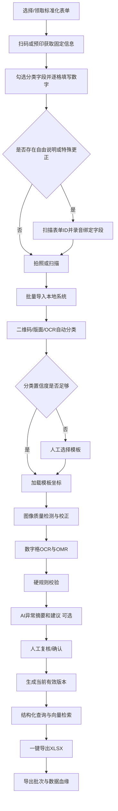
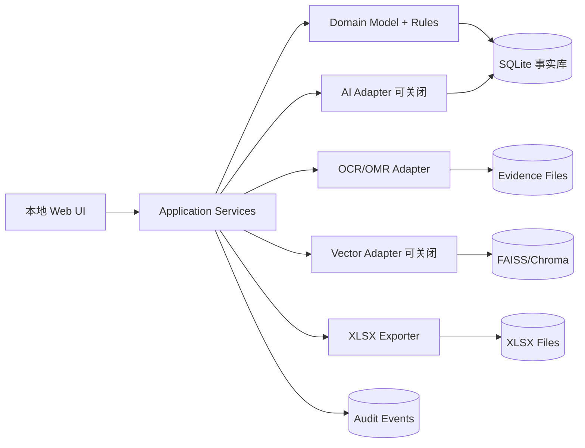
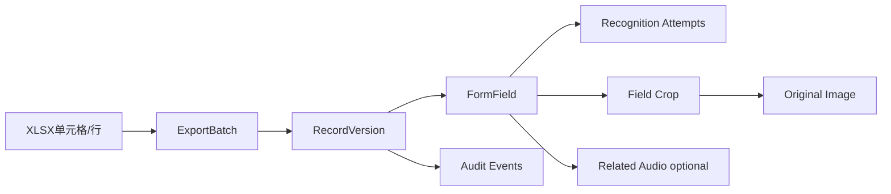
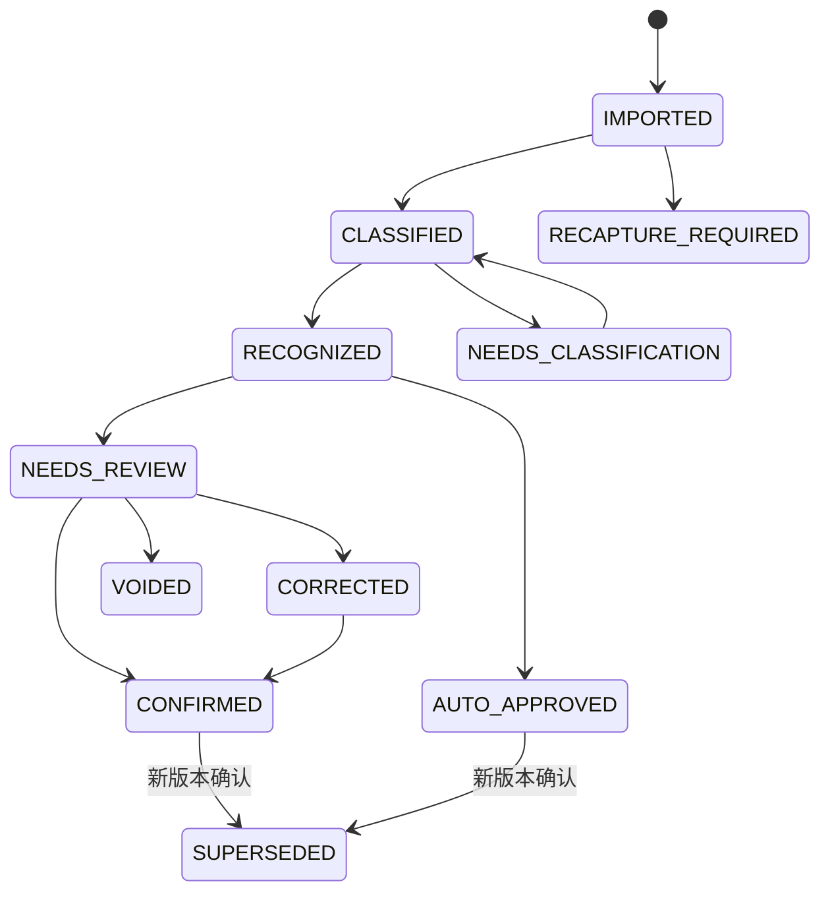

# 工业级产量数据采集系统：单机 Demo 开发规范（AI 协作版）

## 0. 文档使用规则

本文件是开发、代码生成、代码审查和多人协作的唯一需求入口。AI 或开发人员执行任务时必须遵守：

1. 先读取本文件，再读取具体模块任务。
2. 不得自行扩大 Demo 范围。
3. 结构化数据库是唯一业务事实源。
4. 图片、录音和字段裁切图是证据，不是业务事实。
5. OCR、ASR 和 AI 输出均为候选结果，不能直接覆盖人工确认值。
6. 正常结构化字段不录音；只有自由填写、E99 其他异常、特殊争议或非常规更正才录音。
7. AI 服务关闭或不可用时，导入、识别、规则、复核、查询、追溯和 XLSX 导出必须继续工作。
8. 工资相关数据优先保证“错误不自动放行”，不以自动化比例最大化为目标。

---

# 1. 项目目标

## 1.1 业务问题

当前车间使用纸质产量单记录员工、工单、工序、数量和异常。存在以下问题：

- 表单类型和版本较多；
- 工人自由手写导致识别难、口径不统一；
- 财务需要重复录入 Excel；
- 同一数据被工资、产量、质量和工单统计反复使用；
- 数据修改、导出和复核过程难以追溯；
- 审核人员定位原始表单和相关证据耗时较长。

## 1.2 Demo 目标

在一台普通 Windows 电脑上跑通：

```text
结构化填写
→ 图片/录音导入
→ 表单分类
→ 图像校正
→ 数字格 OCR/勾选识别
→ 硬规则校验
→ AI 辅助建议（可选）
→ 人工确认
→ 精确/语义检索
→ 一键导出 XLSX
→ 从导出结果反向追溯原始证据
```

Demo 必须证明：

- 工人能按结构化规则填写；
- 录入员主要处理异常，而不是逐项抄写；
- 同一数据只采集和确认一次，可被多个统计用途复用；
- 任意导出数据都能追溯到原图、字段识别、录音（如有）和修改记录；
- 实际处理时间和错误率相对人工基线明显下降。

## 1.3 非目标

本阶段不实现：

- 全部历史模板；
- 多车间、多用户高并发；
- 正式工资系统直连；
- 生产级服务器、高可用和容灾；
- 依赖方言 ASR 完成核心数字采集；
- AI 自动批准工资数据；
- AI 判断工人主观责任或是否故意造假。

---

# 2. Demo 边界

| 项目 | 约束 |
|---|---|
| 模板 | 3 种代表性表单，每种固定 1 个版本 |
| 字段 | 10-15 个标准字段 |
| 试点 | 1 个班组或工序，10-20 名工人 |
| 技术测试 | 30-50 张表单 |
| 现场试点 | 100-300 张表单 |
| 采集 | 固定手机支架或扫描仪 |
| 运行环境 | 单台 Windows 10/11 电脑 |
| 数据库 | SQLite |
| 文件 | 本地分层目录，原始证据只读 |
| 向量索引 | FAISS 或 Chroma，可关闭 |
| AI | 可配置云端 API 或本地模型，可完全关闭 |
| 输出 | 工资基础、产量统计、质量分析 XLSX |

## 2.1 设计优先级

```text
自动带出
> 扫码
> 勾选
> 数字一格一位
> 原因编码
> 自由文字
```

自由手写字段目标占比：`<= 5%`。

---

# 3. 核心业务规则

## 3.1 字段输入方式

| 字段类型 | 输入方式 | OCR/OMR | 录音 |
|---|---|---|---|
| 表单 ID、模板、日期 | 二维码、预印或系统生成 | 二维码识别 | 否 |
| 工号、工单、产品 | 扫码或预印编码 | 扫码失败时才识别 | 否 |
| 班次、工序、异常类别 | 单选/复选 | OMR | 否 |
| 数量字段 | 一格一位阿拉伯数字 | 逐格 OCR | 否 |
| E99 其他、特殊说明 | 最多 20 字关键词 | 仅参考 | 是 |
| 规范更正 | 独立更正区 | OCR | 通常否 |
| 非常规更正/争议 | 更正区 | OCR | 是 |

## 3.2 数字填写约束

- 仅允许 `0-9`；
- 每格一个数字；
- 禁止连笔、中文数字、千位逗号；
- 不得跨格或压线；
- 空值按字段配置留空或填 `0`；
- 错误不得覆盖原值，必须在更正区填写；
- 位数、取值范围和小数规则由字段字典定义。

## 3.3 录音触发规则

录音仅在以下条件触发：

```text
exception_code == E99
OR exception_note 非空
OR correction_type == UNUSUAL
OR dispute_flag == true
```

录音要求：

- 先扫描表单二维码；
- 绑定 `form_id` 和具体字段/异常类型；
- 内容覆盖：发生什么、影响字段、正确情况、处理或确认人；
- 建议不超过 30 秒；
- 保存原始音频；
- AI 转写和摘要仅作辅助；
- 原始录音不能被摘要替代或覆盖。

## 3.4 当前有效值

```text
current_value = 最新有效人工确认值
```

若字段满足经批准的自动通过策略：

```text
current_value = 有完整证据的 AUTO_APPROVED 值
```

以下数据必须分别保存，不得互相覆盖：

- OCR 原值；
- OCR 候选值和置信度；
- AI 建议值；
- 人工更正值；
- 当前有效值；
- 历史版本。

---

# 4. 端到端流程



## 4.1 表单分类优先级

```text
二维码 template_id
→ 预印模板编号
→ 版面特征
→ 表头 OCR
→ 人工选择
```

分类被人工修改后必须：

1. 保留原分类结果；
2. 记录修改人、时间和原因；
3. 重新加载正确模板；
4. 重新裁切并识别；
5. 生成审计事件。

---

# 5. 系统架构



## 5.1 四层数据职责

| 层 | 责任 | Demo 实现 |
|---|---|---|
| 事实层 | 当前有效数据、状态、版本、精确查询、报表 | SQLite |
| 证据层 | 原图、录音、字段裁切图、文件哈希 | 本地只读目录 |
| 检索层 | 表单摘要、异常说明、录音转写的语义检索 | FAISS/Chroma |
| 审计层 | 导入、分类、识别、修改、确认、导出事件 | SQLite 事件表/JSONL |

## 5.2 模块边界

| 模块 | 输入 | 输出 | 禁止行为 |
|---|---|---|---|
| Template Service | 模板配置、图片 | 模板 ID、字段坐标 | 不修改业务事实 |
| Import Service | 图片/录音文件 | EvidenceFile、Form | 不覆盖原始文件 |
| Classification Service | 图片、模板库 | 分类候选 | 不直接确认低置信度分类 |
| Image Pipeline | 图片、模板坐标 | 校正图、字段裁切图 | 不写入确认值 |
| Recognition Service | 字段裁切图 | OCR/OMR 候选 | 不覆盖旧识别结果 |
| Rule Engine | 候选/当前值、主数据 | RuleResult | 不调用 AI 代替确定规则 |
| AI Review Service | OCR、规则、录音、历史案例 | 结构化建议 | 不自动写入事实 |
| Review Service | 候选、证据、人工操作 | RecordVersion | 不删除历史版本 |
| Search Service | 结构化条件/自然语言 | 结果列表 | 向量结果不能作为精确统计 |
| Export Service | 已确认记录、导出模板 | XLSX、ExportBatch | 不导出未确认/旧版本 |
| Trace Service | form_id/field_id/batch_id | 完整证据链 | 不省略历史操作 |

---

# 6. 功能需求

## FR-01 模板库与字段配置

必须支持：

- 模板 ID、名称、分类和版本；
- 字段坐标；
- 输入类型：二维码、OMR、数字格、短文本；
- 标准字段映射；
- 字段范围、必填和业务规则；
- 导出字段映射；
- 启用/停用；
- 项目内 3 种模板。

**验收：**修改坐标或含义必须创建新版本；旧表单按旧版本处理。

## FR-02 批量导入与证据绑定

必须支持：

- 批量导入图片；
- 按需导入自由说明录音；
- 读取/生成 `form_id`；
- SHA-256 哈希；
- 重复文件和重复表单检测；
- 录音绑定到 `form_id`、字段和异常类型；
- 原始证据不可静默覆盖。

## FR-03 自动分类与人工选择

必须支持：

- 二维码优先；
- 分类候选和置信度；
- 待分类队列；
- 人工重新分类；
- 重新分类后重新识别；
- 分类审计记录。

## FR-04 图像质量与预处理

必须支持：

- 旋转和透视校正；
- 定位点检测；
- 灰度/二值化；
- 模糊、反光、缺角检测；
- 不合格图片进入 `RECAPTURE_REQUIRED`；
- 模板坐标裁切字段。

## FR-05 数字格 OCR 与 OMR

必须支持：

- 逐格识别 `0-9`；
- 勾选框识别；
- 每个字段保存候选、置信度、模型版本；
- 保存字段裁切图；
- 识别结果不可覆盖历史 Attempt。

## FR-06 规则引擎

至少支持：

- 必填；
- 取值范围；
- 数量闭合；
- 合格数不得大于总产量；
- 工号/工单有效性；
- 重复表单；
- 当前有效版本；
- 已导出后更正；
- 导出字段映射完整性。

规则结果必须可定位到具体字段，并输出机器可读错误码。

## FR-07 AI 辅助录入与审查（可关闭）

首版只实现：

1. 异常摘要；
2. 建议值；
3. 自然语言查询转结构化筛选；
4. 可选录音转写/摘要；
5. 相似历史异常辅助说明。

AI 结构化输出：

```json
{
  "form_id": "FORM-0001",
  "risk_level": "MEDIUM",
  "summary": "数量闭合失败，低置信度字段为不良数。",
  "suggestions": [
    {
      "field_name": "defective_quantity",
      "current_candidate": 88,
      "suggested_value": 8,
      "confidence": 0.91,
      "evidence_types": ["RULE", "FIELD_IMAGE", "AUDIO_TRANSCRIPT"],
      "reason": "总产量328减合格数320等于8。"
    }
  ],
  "missing_information": [],
  "requires_human_confirmation": true
}
```

AI 禁止：

- 自动修改工资/产量事实；
- 用历史相似案例直接决定当前值；
- 缺少证据时补齐关键数量；
- 判断工人是否故意造假；
- AI 故障时阻断核心流程。

## FR-08 人工复核与版本确认

复核页必须同屏展示：

- 原始表单；
- 字段裁切图；
- OCR 原值和置信度；
- 硬规则；
- AI 建议；
- 自由说明录音和转写（如有）；
- 历史版本；
- 修改影响的报表和导出批次。

每次更正必须保存：

- 修改前值；
- 修改后值；
- 修改原因；
- 修改人；
- 时间；
- 证据 ID；
- 新版本号。

## FR-09 查询与快速审查

精确检索必须支持：

- 表单 ID；
- 工号；
- 工单；
- 日期范围；
- 车间、班组、班次；
- 模板和版本；
- 复核状态；
- 是否有录音；
- 是否人工更正；
- 是否已导出；
- 导出批次；
- 异常类型；
- OCR 置信度范围。

向量检索用于：

- 相似填写错误；
- 相似异常处理；
- 录音和备注冲突；
- 模板候选辅助；
- 自然语言检索结果排序。

**约束：**精确求和、工资统计和当前版本判断只能由 SQLite 执行。

## FR-10 一键导出 XLSX

必须支持：

- 导出当前筛选结果；
- 导出全部可导出记录；
- 选择工资、产量、质量等用途；
- 使用企业现有 Excel 模板映射；
- 生成导出批次；
- 导出前预览和异常统计；
- 已导出后更正触发 `REEXPORT_REQUIRED`；
- 新版本文件不得覆盖旧 XLSX。

建议工作表：

| Sheet | 内容 |
|---|---|
| 正式数据 | 当前有效且可导出的记录 |
| 异常与复核 | OCR 原值、最终值、修改原因和证据 |
| 汇总 | 按员工、日期、工单、工序汇总 |
| 导出说明 | 批次、筛选条件、版本、文件哈希 |

## FR-11 数据血缘与反向追溯

必须实现：



任一导出数字必须可定位：

- 导出批次；
- form_id；
- 字段 ID；
- 当前有效版本；
- OCR 原值；
- AI 建议；
- 人工更正历史；
- 原图和字段裁切；
- 相关录音；
- 模板、OCR、规则和 AI 版本。

---

# 7. 数据模型

## 7.1 核心实体

### Form

```yaml
form_id: string                 # 全局唯一
template_id: string
template_version: string
coordinate_version: string
review_status: enum
export_status: enum
current_record_version: integer
created_at: datetime
```

### FormField

```yaml
field_id: string
form_id: string
field_name: string
source_region: {x, y, width, height}
current_value: any
current_value_source: HUMAN_CONFIRMED | AUTO_APPROVED
current_record_version: integer
```

### RecognitionAttempt

```yaml
attempt_id: string
field_id: string
engine: string
model_version: string
candidate_value: any
confidence: float
created_at: datetime
crop_file_id: string
```

### EvidenceFile

```yaml
file_id: string
form_id: string
related_field_id: string | null
type: ORIGINAL_IMAGE | AUDIO | FIELD_CROP | CORRECTED_IMAGE
path_or_uri: string
sha256: string
immutable: boolean
created_at: datetime
```

### RecordVersion

```yaml
record_id: string
form_id: string
version: integer
previous_version: integer | null
status: DRAFT | AUTO_APPROVED | CONFIRMED | CORRECTED | SUPERSEDED | VOIDED
values: object
change_reason: string
confirmed_by: string | null
created_at: datetime
```

### AuditEvent

```yaml
event_id: string
form_id: string
event_type: string
actor_id: string
timestamp: datetime
before: object | null
after: object | null
reason: string | null
evidence_ids: string[]
```

### ExportBatch

```yaml
export_batch_id: string
export_type: PAYROLL | OUTPUT | QUALITY | WORK_ORDER
filters: object
included_records: [{form_id, record_version}]
file_path: string
file_sha256: string
exported_by: string
exported_at: datetime
supersedes_batch_id: string | null
```

### VectorDocument

```yaml
vector_id: string
form_id: string
content_type: FORM_SUMMARY | OCR_TEXT | EXCEPTION | AUDIO_TRANSCRIPT | TEMPLATE
content: string
metadata: object
embedding_model: string
created_at: datetime
```

## 7.2 标准字段字典（首版示例）

| 字段 | 类型 | 必填 | 约束 | 主要用途 | 来源 |
|---|---|---:|---|---|---|
| form_id | string | 是 | 全局唯一 | 追溯、去重 | 二维码/系统 |
| employee_id | string | 是 | 员工主数据存在 | 工资、查询 | 扫码/预印 |
| work_order_id | string | 是 | 有效工单 | 进度、产量 | 二维码 |
| total_quantity | integer | 是 | 0-99999 | 产量、进度 | 数字格 OCR |
| qualified_quantity | integer | 是 | 0-total | 工资、质量 | 数字格 OCR |
| defective_quantity | integer | 否 | 0-total | 质量 | 数字格 OCR |
| exception_code | enum | 否 | E01-E99 | 异常统计 | OMR |
| exception_note | string | 条件必填 | <=20 字 | 异常说明 | 手写+录音 |
| review_status | enum | 是 | 状态机 | 流程控制 | 系统 |
| current_version | integer | 是 | >=1 | 追溯 | 系统 |

---

# 8. 状态机

复核状态和导出状态必须分开。



导出状态：

```text
NOT_EXPORTED
→ EXPORTED
→ REEXPORT_REQUIRED（已导出记录发生更正）
→ EXPORTED（生成更正版批次）
```

AI 状态：

```text
NOT_RUN | SUGGESTED | UNAVAILABLE | ADOPTED | REJECTED
```

---

# 9. 页面需求

| 页面 | 必须能力 |
|---|---|
| 仪表盘 | 导入、待分类、待复核、可导出、异常和效果指标 |
| 模板管理 | 模板/版本/字段坐标/映射/启停 |
| 批量导入 | 图片/录音导入、重复检测、绑定、质量结果 |
| 分类确认 | 自动分类、候选模板、人工选择、重新识别 |
| 复核页 | 原图、裁切图、OCR、规则、AI、录音、版本、确认 |
| 全局搜索 | 精确筛选、自然语言条件、相似异常 |
| 追溯详情 | 证据、识别、修改、版本、统计用途、导出批次 |
| 导出页 | 用途、筛选、校验预览、一键 XLSX、批次历史 |

审查操作目标：

```text
结果列表
→ 查看异常摘要
→ 必要时查看原图/录音
→ 采用建议或手动修正
→ 确认
```

单张异常表单应尽量在一个页面内完成。

---

# 10. 本地技术方案

| 层 | 推荐技术 |
|---|---|
| Python | Python 3.11 |
| UI | Streamlit（首选）或 FastAPI + 简单前端 |
| 图像处理 | OpenCV |
| OCR | PaddleOCR 或轻量数字分类器 |
| 二维码 | OpenCV QRCodeDetector / pyzbar |
| 数据库 | SQLite + SQLAlchemy（建议） |
| 文件存储 | 本地目录 + 文件 ID 抽象 |
| 向量库 | FAISS 或 Chroma，可关闭 |
| AI | Adapter，可接云端或本地模型 |
| XLSX | openpyxl |
| 测试 | pytest |

## 10.1 目录结构

```text
demo-system/
├─ README.md
├─ pyproject.toml
├─ app/
│  ├─ domain/                 # 实体、状态、规则接口
│  ├─ application/            # 用例和编排
│  ├─ adapters/
│  │  ├─ database/
│  │  ├─ storage/
│  │  ├─ ocr/
│  │  ├─ ai/
│  │  └─ vector/
│  ├─ services/
│  └─ ui/
├─ config/
│  ├─ fields/
│  ├─ rules/
│  └─ exports/
├─ templates/
│  └─ <template-id>/<version>/
│     ├─ template.json
│     └─ reference.png
├─ data/
│  ├─ evidence/
│  │  ├─ images/
│  │  ├─ audio/
│  │  └─ field-crops/
│  ├─ database/demo.db
│  ├─ vectors/
│  ├─ exports/
│  └─ backups/
├─ tests/
│  ├─ unit/
│  ├─ integration/
│  ├─ fixtures/
│  └─ golden/
└─ scripts/
```

**约束：**业务代码不得依赖绝对路径；所有存储通过 Adapter 返回 `file_id` 和 URI。

## 10.2 性能目标

| 项目 | 目标 |
|---|---:|
| 单张图预处理 + OCR | <= 5 秒 |
| 100 张批量处理 | 可排队、有进度、不阻塞复核 |
| 常用精确查询 | <= 1 秒 |
| 打开追溯详情 | <= 2 秒 |
| 300 条 XLSX 导出 | <= 10 秒 |

---

# 11. 安全与审计

- 默认不上传表单、工资数据和录音到公共云；
- 使用外部 AI 前必须取得企业授权并脱敏；
- 录音用途、访问权限、保存周期和训练授权必须明确；
- 原始证据文件只读；
- 重新采集生成新证据版本；
- 关键更正建议修改人与确认人分离；
- 所有更正、确认、作废、导出和重算写入 AuditEvent；
- 数据库和导出文件存放于受控目录并定期备份；
- AI 建议必须显示证据，不得静默修改事实。

---

# 12. 测试与验收

## 12.1 金标准

```text
录入员 A 独立录入
+ 录入员 B 独立复核
+ 不一致时负责人裁决
= 金标准
```

调试集和最终测试集分离；尽量避免同一工人的相似字迹同时用于调参与最终评估。

## 12.2 必测场景

- 正常填写且无录音；
- E99 其他并绑定录音；
- 二维码损坏，候选分类 + 人工选择；
- 数字越格及 `1/7`、`3/8`、`5/6` 混淆；
- 模糊、反光、缺角、透视；
- 数量闭合失败；
- 重复表单/重复文件；
- 人工更正后导出；
- 已导出后再次更正；
- AI 不可用；
- 向量检索返回相似案例但不修改事实；
- 任一 XLSX 行反向追溯原图和事件。

## 12.3 验收指标

| 指标 | Demo 目标 |
|---|---:|
| 自动分类正确率 | >= 98%（二维码优先） |
| 图片质量合格率 | >= 95% |
| 单数字识别准确率 | >= 95% |
| 关键字段整单正确率 | >= 85% |
| 错误自动放行率 | 接近 0 |
| 重复表单拦截率 | 100% |
| 导出数据可追溯率 | 100% |
| 人工修改留痕率 | 100% |
| 财务平均处理时间 | 下降 >= 50% |
| 需要录音的表单绑定成功率 | >= 98% |
| AI 关闭可运行 | 必须 |

## 12.4 效果评价

不能只报告字符准确率，还必须比较：

- 每张表平均处理时间；
- 自动/快速确认比例；
- 错误自动放行率；
- 异常发现率；
- 重复录入减少量；
- 审查追溯耗时；
- 工人新增操作时间；
- AI 建议正确率、采用率和错误建议率。

---

# 13. 开发阶段

| 阶段 | 内容 | 退出条件 |
|---|---|---|
| 0. 业务冻结 | 3 种表单、字段字典、闭合规则、录音触发、XLSX 样式 | 样张和映射确认 |
| 1. 人工闭环 | 导入、人工复核、事实/版本、查询、追溯、XLSX | 无 OCR 也能全流程运行 |
| 2. OCR 与分类 | 二维码、分类、校正、数字 OCR、OMR | 30-50 张达到基本指标 |
| 3. 规则与审计 | 规则、异常队列、版本、事件、重复检测 | 修改不静默覆盖 |
| 4. AI 与向量 | 摘要、建议、可选录音转写、相似检索 | AI 可关闭且输出有证据 |
| 5. 现场试点 | 100-300 张，比较时间和错误 | 形成服务器部署建议 |

---

# 14. 服务器迁移约束

Demo 成功后只替换基础设施，不重写业务逻辑：

| 单机 Demo | 服务器版本 |
|---|---|
| SQLite | PostgreSQL/MySQL |
| 本地文件 | NAS/对象存储 |
| FAISS/Chroma | Qdrant/Milvus |
| Streamlit/本地 Web | 局域网多用户 Web |
| 本机任务 | 后台 Worker/任务队列 |
| 本地备份 | 集中备份、审计和容灾 |

必须提前抽象：

- Repository；
- Storage；
- OCR Adapter；
- AI Adapter；
- Vector Adapter；
- Exporter；
- 统一领域实体和状态机。

---

# 15. 开发前待确认

- [ ] 冻结 3 种表单样张和版本；
- [ ] 明确总产量、合格、不良、返工的闭合口径；
- [ ] 确认员工、工单、产品和工序编码；
- [ ] 确认哪些自由字段必须录音；
- [ ] 确认录音人、保存周期和使用权限；
- [ ] 决定哪些字段允许 AUTO_APPROVED；
- [ ] 确认修改人和最终确认人权限；
- [ ] 获取企业现有工资/产量/质量 XLSX 模板；
- [ ] 获取 30-50 张脱敏真实样张和金标准；
- [ ] 明确是否允许外部 AI API；
- [ ] 测量当前财务录入时间和错误率基线。

---

# 16. Definition of Done

一个功能只有同时满足以下条件才算完成：

- 有明确输入、输出和错误码；
- 有单元测试；
- 关键路径有集成测试；
- 不覆盖原始证据或历史版本；
- 产生必要 AuditEvent；
- AI 关闭时核心流程可运行；
- UI 中可显示失败原因；
- 文档和配置示例已更新；
- 不引入未批准的 Demo 范围；
- 通过相关验收用例。
